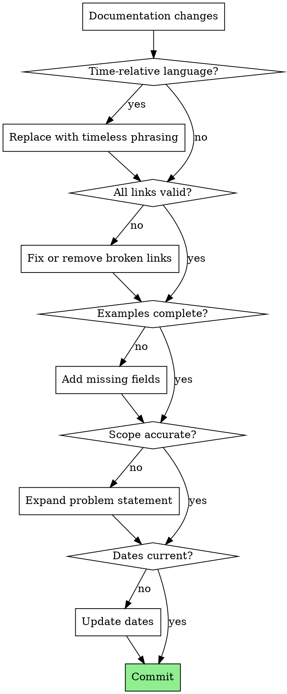

# Writing Documentation

## Overview

Technical documentation must be accurate, consistent, and timeless. This skill ensures documentation quality by catching common issues before they're committed.

**Core principle:** Documentation should be accurate today and remain accurate tomorrow.

## When to Use

Use this skill when:
- Writing new documentation
- Updating existing documentation
- Reviewing documentation changes
- Creating examples or code snippets in docs

## Documentation Quality Checklist

### Content Accuracy

| Check | Description |
|-------|-------------|
| **Scope coverage** | Problem statements reflect full functionality, not subsets |
| **Examples complete** | All examples include required AND commonly-used optional fields |
| **Links valid** | All file references exist; no broken links |
| **No duplicates** | Content is not repeated across sections or files |

### Timelessness

| Check | Bad Example | Good Example |
|-------|-------------|--------------|
| No time-relative language | "three new CRDs" | "four CRDs in total" |
| No temporal markers | "recently added" | [describe the feature directly] |
| Current dates | "Last updated: 2026-02-28" | Update to actual change date |

### Consistency

| Check | Description |
|-------|-------------|
| **Cross-file examples** | Same resource type shown consistently across all docs |
| **Terminology** | Same terms used for same concepts |
| **Structure** | Similar sections follow similar patterns |

## Red Flags - Fix Before Committing

- "new", "recently", "just added", "now supports"
- Links to files that don't exist
- Examples missing optional fields that should be shown
- Problem statement narrower than actual scope
- "Last updated" dates not matching changes
- Duplicate sections or content

## Common Rationalizations

| Excuse | Reality |
|--------|---------|
| "The example works without that optional field" | Incomplete examples confuse users. Show best practices. |
| "I'll update the dates later" | Later never comes. Update now. |
| "It's clear from context" | If it's not explicit, it's ambiguous. |
| "The link might be created later" | Create the file first, or remove the link. |
| "This is a minor detail" | Documentation quality is in the details. |

## Documentation Review Process



## Quick Reference: Common Fixes

| Issue | Fix |
|-------|-----|
| "new feature" | Describe what it does |
| "recently added" | Remove the qualifier |
| "X new CRDs" | "X CRDs in total" |
| Missing schemaRef | Add with comment `# Optional: defaults to "public"` |
| Broken link | Create file or remove reference |
| Outdated date | Update to current date |

## Verification Commands

```bash
# Check for time-relative language
grep -rn "new\|recently\|just added" docs/

# Check for broken markdown links
grep -rn "\[.*\](docs/" README.md | while read line; do
  file=$(echo "$line" | sed 's/.*](\([^)]*\)).*/\1/')
  [ -f "$file" ] || echo "BROKEN: $file"
done

# Verify all examples have required fields
grep -A20 "kind: RisingWaveConnection" docs/ | grep -q "schemaRef" || echo "Missing schemaRef"
```
